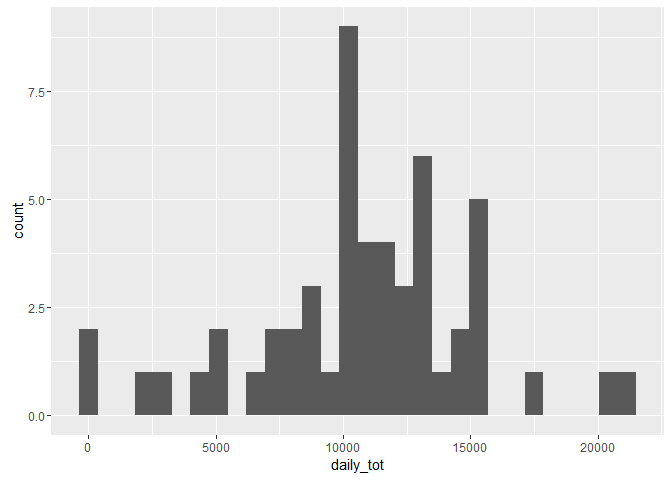
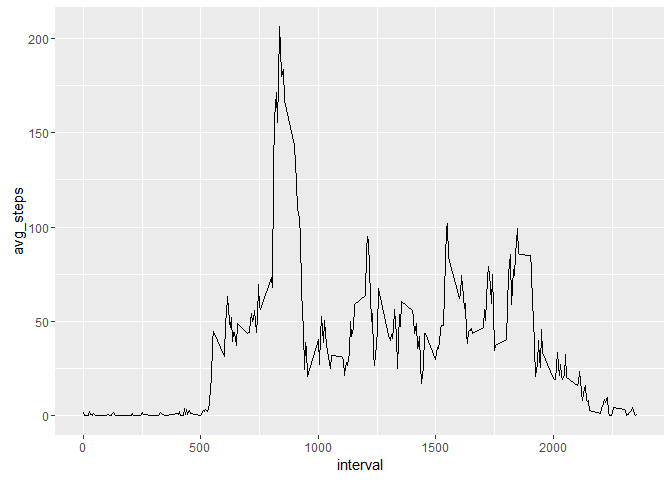
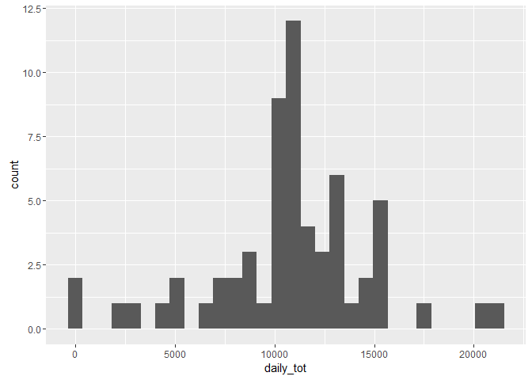
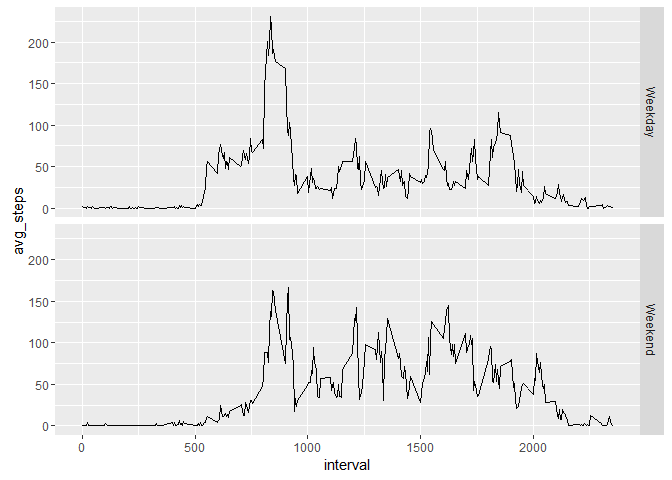

# Reproducible Research: Peer Assessment 1

```r
##Setting global options
library(knitr)
opts_chunk$set(echo=TRUE, warning=FALSE, message=FALSE,
               root.dir='D:/Git/repository/RepData_PeerAssessment1/')
library(dplyr)
```

```
## 
## Attaching package: 'dplyr'
```

```
## The following objects are masked from 'package:stats':
## 
##     filter, lag
```

```
## The following objects are masked from 'package:base':
## 
##     intersect, setdiff, setequal, union
```

```r
library(ggplot2)
```

## Loading and preprocessing the data

```r
df<-read.csv('activity/activity.csv')
df$date<-as.Date(df$date) #change to Date format
```

## What is mean total number of steps taken per day?

```r
daily_steps<-df%>%group_by(date)%>%summarise(daily_tot = sum(steps))
ggplot(daily_steps, aes(daily_tot))+geom_histogram()
```

<!-- -->

The mean total number of steps taken per day is 10766.19 steps.
And the median number of steps taken per day is 10765 steps.

## What is the average daily activity pattern?

```r
avg_int <- df%>%group_by(interval)%>%summarise(avg_steps=mean(steps, na.rm= T))
ggplot(avg_int, aes(interval, avg_steps))+geom_line()
```

<!-- -->

On average across all the days in the dataset, interval 835 contains the maximum number of steps.

## Imputing missing values

The total number of missing values in the dataset is 2304.

```r
#use the averaged steps for each interval to fill NA values
avg_int$round_steps<-round(avg_int$avg_steps)
df_complete<-merge(df, avg_int, by.x = 'interval', by.y = 'interval')
df_complete$comp_steps<-c(rep(NA,nrow(df_complete)))
for (i in (1:nrow(df_complete))){
  df_complete$comp_steps[i]<- if (is.na(df_complete$steps[i])){
     df_complete$round_steps[i]} else {df_complete$steps[i]}
}
df_complete<-df_complete[,c(6,3,1)]

daily_steps_comp<-df_complete%>%group_by(date)%>%summarise(daily_tot = sum(comp_steps))
ggplot(daily_steps_comp, aes(daily_tot))+geom_histogram()
```

<!-- -->

After filling the missing values, the mean total number of steps taken per day is 10765.64 steps.
And the median number of steps taken per day is 10762 steps.
The estimates are slightly lower than before.

## Are there differences in activity patterns between weekdays and weekends?

```r
df_complete$weekday<-weekdays(df_complete$date)
df_complete$day<-c(rep(NA,nrow(df_complete)))
for (i in (1:nrow(df_complete))){
  df_complete$day[i]<- if (df_complete$weekday[i] == 'Saturday'| df_complete$weekday[i] =='Sunday'){
     'Weekend'} else {'Weekday'}
}
df_day<-df_complete%>%group_by(interval, day)%>%summarise(avg_steps=mean(comp_steps, na.rm= T))
ggplot(df_day, aes(interval, avg_steps))+geom_line()+facet_grid(day~.)
```

<!-- -->
